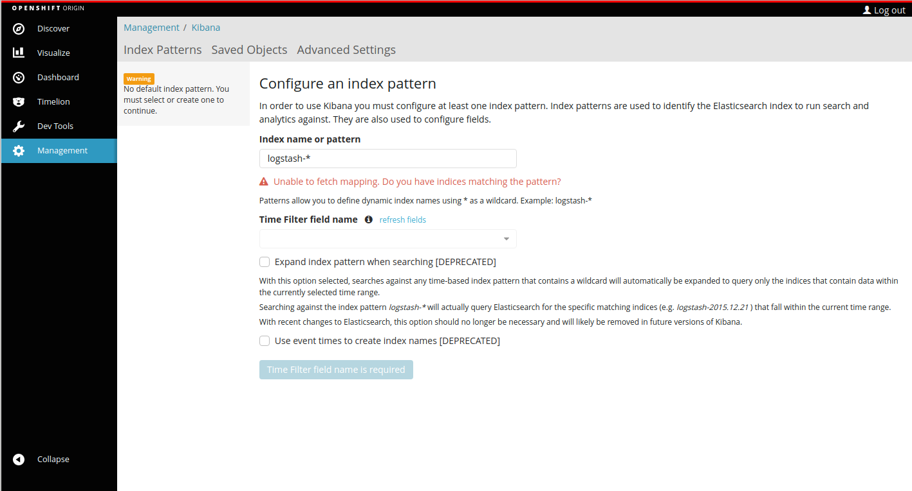

# origin-kibana
This repo provide a plugin to the Kibana Visualization tool to
add OpenShift specific requirements.  The main features added
by this plugin are:

* Origin skinning

###
Overriding Styles
The plugin adds an empty stylesheet `$PLUGIN/public/styles/overrides.css' as a hook
for users to modify the styles.  After deployment, you might wish to modify the header
style to include a custom header logo:

```
.container-brand {
  margin-top: 3px;
  height: 11px;
  background-image: url("../images/my-custom-image.svg");
  background-size: 111px 11px;
  background-repeat: no-repeat;
}
```
This stylesheet is loaded after the main stylesheet provided by the plugin.

Currently compatible with the **5.6.x** code stream of Kibana

### Hacking the code
* Download and install [Elasticsearch](https://www.elastic.co/downloads/elasticsearch)
* Clone the Openshift `origin-kibana` repo
* Run `npm install` to install node dependencies
* Run `bower install` to install patternfly locally
* Run `grunt` to build main.css
* Start Kibana to use this plugin `npm start`

### Current supported fragment parameters
When linking to kibana with the origin-kibana plugin you can control the container name and link back to the main console by setting the following parameters in the document hash:

| parameter | Description|
| ------ | ------|
| `console_back_url` | Used as the URL in the back link to get back to the main console |
| `console_auth_token` | Contains the authorization token for the user logged into the main console |

Any parameter in the document hash prefixed with `console_` will be removed from the document hash once the UI is loaded.

To test it out you can access the kibana console with a URL like:

```
http://localhost:5601/#/dashboard#console_back_url=http:%2F%2Flocalhost:8443&console_auth_token=wheetoken
```

Which will modify the UI to:


